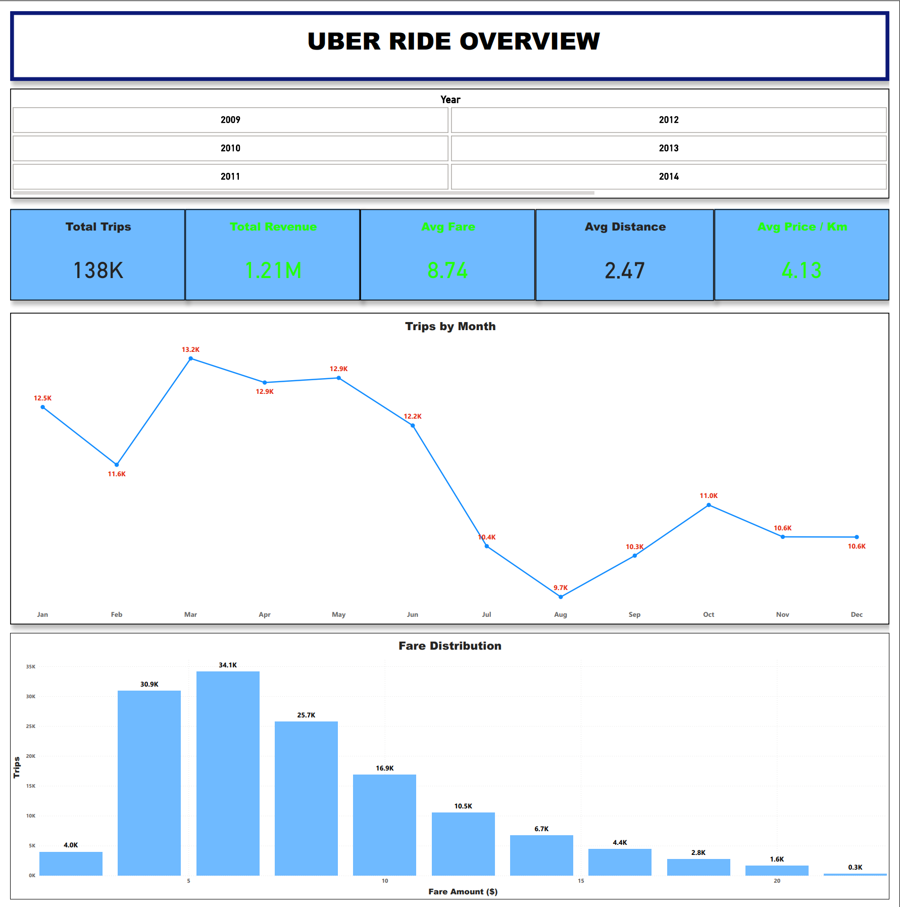
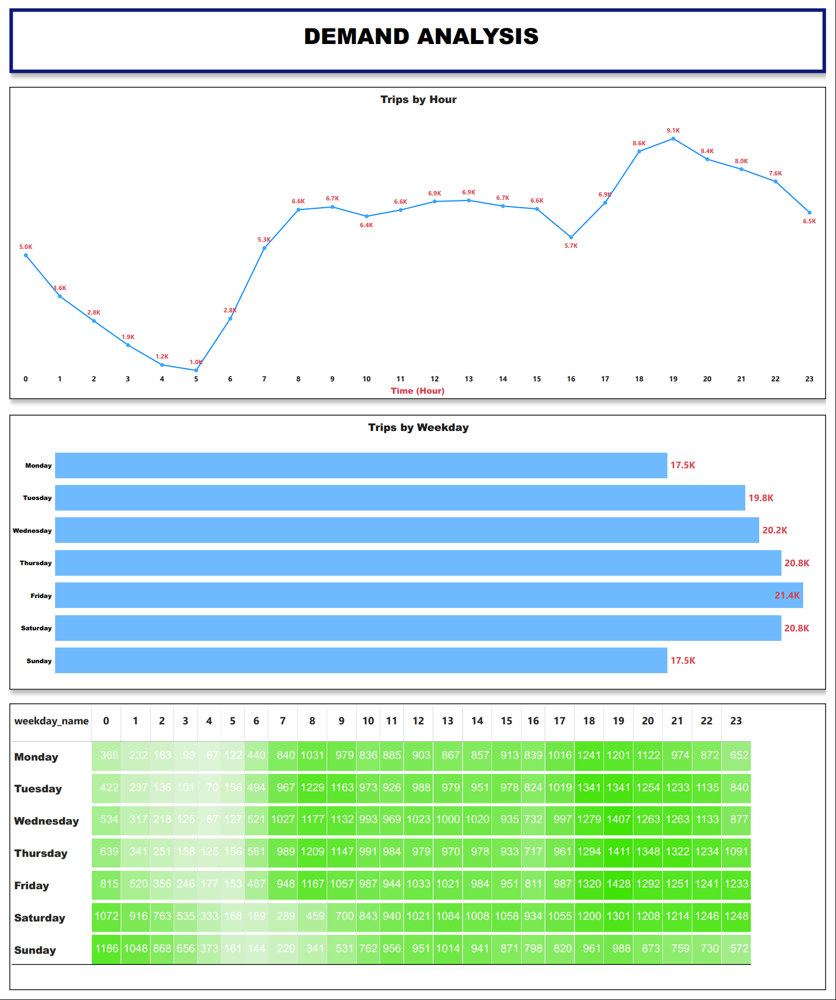
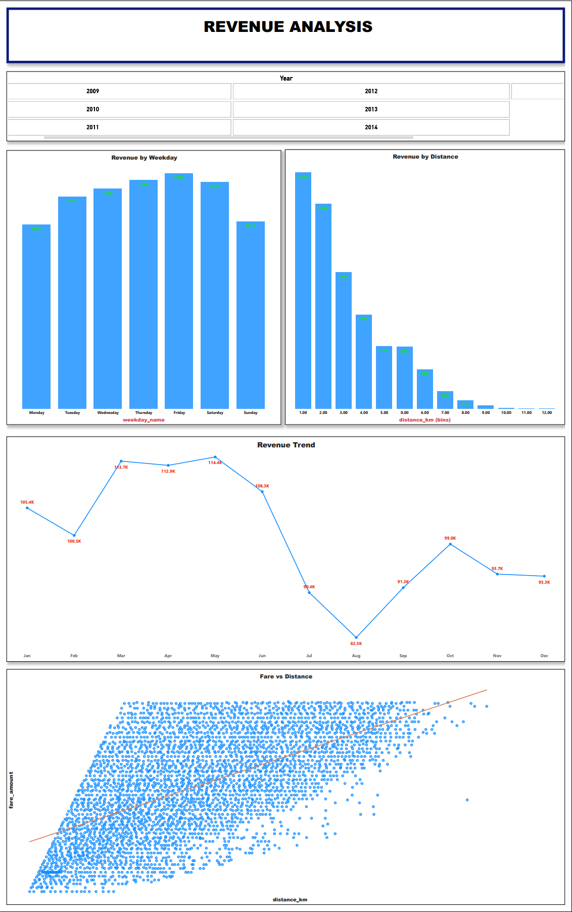

# 🚕 Uber Fares Data Analysis & Business Insights Dashboard

## 📌 Project Summary

* This project analyzes Uber ride data to uncover patterns in **ride demand, pricing, trip distance, and revenue performance**.

* Using **Python for data cleaning and feature engineering** and **Power BI for interactive visualization**, the project transforms raw trip data into meaningful business insights.

### Key Business Questions

* ⏰ When is Uber ride demand highest?
* 📏 How does trip distance affect fare pricing?
* 💰 Which time periods generate the most revenue?
* 📍 What geographic areas generate the most pickups?

The final result is a **multi-page Power BI dashboard** designed to help understand ride behavior and revenue patterns.

---

# 🧠 Business Problem

Ride-sharing platforms generate massive amounts of **trip-level data**.

However, raw data often contains:

* missing values
* outliers
* unrealistic records

Before insights can be generated, the data must be **cleaned and structured**.

This project demonstrates a **typical Data Analyst workflow**:

1️⃣ Data cleaning and preprocessing
2️⃣ Feature engineering
3️⃣ Exploratory data analysis
4️⃣ Business dashboard development

The goal is to convert raw operational data into **actionable insights for decision making**.

---

# 📂 Dataset

The dataset contains historical **Uber trip records** with the following fields:

* `pickup_datetime`
* `passenger_count`
* `pickup_latitude`
* `pickup_longitude`
* `dropoff_latitude`
* `dropoff_longitude`
* `fare_amount`

These variables allow analysis of:

* 🚕 trip demand patterns
* 💵 pricing behavior
* 🗺 geographic ride distribution
* 📊 revenue performance

---

# 🔄 Data Pipeline

```
Raw Dataset
     ↓
Data Cleaning (Python)
     ↓
Outlier Removal
     ↓
Feature Engineering
     ↓
Distance Calculation
     ↓
Exploratory Data Analysis
     ↓
Export Clean Dataset
     ↓
Power BI Dashboard
```

---

# 🧹 Data Cleaning

Several steps were applied to improve data quality.

### Remove unnecessary columns

```
df = df.drop(columns=['Unnamed: 0'])
```

### Remove missing values

```
df = df.dropna()
```

### Remove duplicate records

```
df.duplicated().sum()
```

### Apply data validation rules

To ensure realistic trip records:

* `fare_amount > 0`
* `1 ≤ passenger_count ≤ 6`
* latitude between **(-90, 90)**
* longitude between **(-180, 180)**

---

# 📉 Outlier Detection

Outliers were removed using the **Interquartile Range (IQR) method**.

```
Q1 = df[col].quantile(0.25)
Q3 = df[col].quantile(0.75)

IQR = Q3 - Q1

lower = Q1 - 1.5 * IQR
upper = Q3 + 1.5 * IQR
```

This step ensures that **extreme values do not distort analysis results**.

---

# ⚙️ Feature Engineering

New analytical features were created from the datetime field.

### Time-based features

* Hour
* Day
* Month
* Year
* Weekday

Example:

```
df_clean['hour'] = df_clean['pickup_datetime'].dt.hour
df_clean['weekday_name'] = df_clean['pickup_datetime'].dt.day_name()
```

These variables help identify **temporal demand patterns**.

---

# 📏 Distance Calculation

Trip distance was calculated using the **Haversine formula**.

This allows analysis of:

* fare vs distance
* price per kilometer
* trip distribution

Unrealistic trips were filtered:

* distance < **0.1 km**
* distance > **50 km**

---

# 💲 New Metric: Price per KM

```
price_per_km = fare_amount / distance_km
```

Additional filtering:

* `1 < price_per_km < 20`

This helps analyze **pricing consistency across trips**.

---

# 📊 Exploratory Data Analysis

Key analyses included:

* 📉 Fare distribution
* 📏 Trip distance distribution
* 🔗 Fare vs distance relationship
* ⏰ Ride demand by hour

These analyses helped identify patterns before building the dashboard.

---

# 📊 Power BI Dashboard

The cleaned dataset was exported and used to build an **interactive Power BI dashboard**.

```
df_clean.to_csv("Uber_Clean.csv")
```

---

# 🖥 Dashboard Preview

### 🚕 Ride Overview



### ⏰ Demand Analysis



### 🌍 Geographic Analysis


### 💰 Revenue Analysis



---

# 📈 Key Business Insights

1️⃣ Ride demand peaks during **evening commuting hours**.

2️⃣ The majority of Uber trips are **short-distance rides**.

3️⃣ Fare amount strongly correlates with **trip distance**.

4️⃣ Revenue increases toward **Thursday and Friday**.

5️⃣ Most pickups occur in **dense urban areas**.

---

# 📁 Project Structure

```
Uber-Fares-Analysis
│
├── data
│   └── Uber_Clean.csv
│
├── notebook
│   └── Uber.ipynb
│
├── dashboard
│   └── Uber_Dashboard.pbix
│
├── images
│   ├── overview.png
│   ├── demand.png
│   ├── geo.png
│   └── revenue.png
│
└── README.md
```

---

# 🛠 Skills Demonstrated

* 🧹 Data Cleaning
* ⚙️ Feature Engineering
* 🌍 Geospatial Calculations
* 📊 Exploratory Data Analysis
* 📈 Data Visualization
* 💡 Business Insight Generation
* 🖥 Dashboard Development

**Tools used**

Python • Pandas • NumPy • Matplotlib • Seaborn • Power BI

---

# 👨‍💻 Author

**Nam**

Aspiring **Data Analyst**

Focus areas:

* 📊 Data Analytics
* 📈 Business Intelligence
* 💰 Financial Data Analysis
